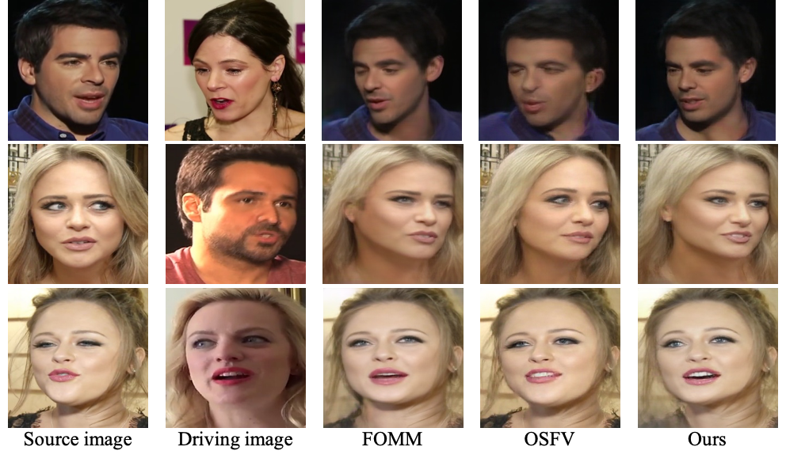

## :book: Depth-Aware Generative Adversarial Network for Talking Head Video Generation (CVPR 2022)
<p align="center">
  <small>:fire: If DaGAN is helpful in your photos/projects, please help to :star: it or recommend it to your friends. Thanks:fire:</small>
</p>

> [[Paper](https://arxiv.org/abs/2203.06605)] &emsp; [[Project Page](https://harlanhong.github.io/publications/dagan.html)] &emsp; [[Demo](https://huggingface.co/spaces/HarlanHong/DaGAN)] &emsp; [[Poster Video](https://www.youtube.com/watch?v=nahsJNjWzGo&t=1s)]<br>
<!-- > [Fa-Ting Hong](https://harlanhong.github.io), [Longhao Zhang](https://dblp.org/pid/236/7382.html), [Li Shen](https://scholar.google.co.uk/citations?user=ABbCaxsAAAAJ&hl=en), [Dan Xu](https://www.danxurgb.net) <br> -->
<!-- > The Hong Kong University of Science and Technology, Alibaba Cloud -->
> [Fa-Ting Hong](https://harlanhong.github.io), [Longhao Zhang](), [Li Shen](), [Dan Xu](https://www.danxurgb.net) <br>
> The Hong Kong University of Science and Technology
### Cartoon Sample
https://user-images.githubusercontent.com/19970321/162151632-0195292f-30b8-4122-8afd-9b1698f1e4fe.mp4

### Human Sample
https://user-images.githubusercontent.com/19970321/162151327-f2930231-42e3-40f2-bfca-a88529599f0f.mp4

### Voxceleb1 Dataset
<p align="center">
  
</p>


:triangular_flag_on_post: **Updates** 
- :fire::fire::white_check_mark: July 26, 2022: The normal dataparallel training scripts were released since some researchers informed me they ran into **DistributedDataParallel** problems. Please try to train your own model using this [command](#dataparallel). Also, we deleted the command line "with torch.autograd.set_detect_anomaly(True)" to boost the training speed.
- :fire::fire::white_check_mark: June 26, 2022: The repo of our face depth network is released, please refer to [Face-Depth-Network](https://github.com/harlanhong/Face-Depth-Network) and feel free to email me if you meet any problem.
- :fire::fire::white_check_mark: June 21, 2022: [Digression] I am looking for research intern/research assistant opportunities in European next year. Please contact me If you think I'm qualified for your position.
- :fire::fire::white_check_mark: May 19, 2022: The depth face model (50 layers) trained on Voxceleb2 is released! (The corresponding checkpoint of DaGAN will release soon). Click the [LINK](https://hkustconnect-my.sharepoint.com/:f:/g/personal/fhongac_connect_ust_hk/EkxzfH7zbGJNr-WVmPU6fcABWAMq_WJoExAl4SttKK6hBQ?e=fbtGlX)

- :fire::fire::white_check_mark: April 25, 2022: Integrated into Huggingface Spaces 🤗 using Gradio. Try out the web demo: [](https://huggingface.co/spaces/HarlanHong/DaGAN) (GPU version will come soon!)
- :fire::fire::white_check_mark: Add **[SPADE model](https://hkustconnect-my.sharepoint.com/:f:/g/personal/fhongac_connect_ust_hk/EjfeXuzwo3JMn7s0oOPN_q0B81P5Wgu_kbYJAh7uSAKS2w?e=XNZl3K)**, which produces **more natural** results.


## :wrench: Dependencies and Installation

- Python >= 3.7 (Recommend to use [Anaconda](https://www.anaconda.com/download/#linux) or [Miniconda](https://docs.conda.io/en/latest/miniconda.html))
- [PyTorch >= 1.7](https://pytorch.org/)
- Option: NVIDIA GPU + [CUDA](https://developer.nvidia.com/cuda-downloads)
- Option: Linux

### Installation
We now provide a *clean* version of DaGAN, which does not require customized CUDA extensions. <br>

1. Clone repo

    ```bash
    git clone https://github.com/harlanhong/CVPR2022-DaGAN.git
    cd CVPR2022-DaGAN
    ```

2. Install dependent packages

    ```bash
    pip install -r requirements.txt

    ## Install the Face Alignment lib
    cd face-alignment
    pip install -r requirements.txt
    python setup.py install
    ```
## :zap: Quick Inference

We take the paper version for an example. More models can be found [here](https://hkustconnect-my.sharepoint.com/:f:/g/personal/fhongac_connect_ust_hk/EjfeXuzwo3JMn7s0oOPN_q0B81P5Wgu_kbYJAh7uSAKS2w?e=KaQcPk).

### YAML configs
See ```config/vox-adv-256.yaml``` to get description of each parameter.

### Pre-trained checkpoint
The pre-trained checkpoint of face depth network and our DaGAN checkpoints can be found under following link: [OneDrive](https://hkustconnect-my.sharepoint.com/:f:/g/personal/fhongac_connect_ust_hk/EjfeXuzwo3JMn7s0oOPN_q0B81P5Wgu_kbYJAh7uSAKS2w?e=KaQcPk).

**Inference!**
To run a demo, download checkpoint and run the following command:

```bash
CUDA_VISIBLE_DEVICES=0 python demo.py  --config config/vox-adv-256.yaml --driving_video path/to/driving --source_image path/to/source --checkpoint path/to/checkpoint --relative --adapt_scale --kp_num 15 --generator DepthAwareGenerator 
```
The result will be stored in ```result.mp4```. The driving videos and source images should be cropped before it can be used in our method. To obtain some semi-automatic crop suggestions you can use ```python crop-video.py --inp some_youtube_video.mp4```. It will generate commands for crops using ffmpeg. 


## :computer: Training


### Datasets
 
1) **VoxCeleb**. Please follow the instruction from https://github.com/AliaksandrSiarohin/video-preprocessing.

### Train on VoxCeleb
To train a model on specific dataset run:
```
CUDA_VISIBLE_DEVICES=0,1,2,3,4,5,6,7 python -m torch.distributed.launch --master_addr="0.0.0.0" --master_port=12348 run.py --config config/vox-adv-256.yaml --name DaGAN --rgbd --batchsize 12 --kp_num 15 --generator DepthAwareGenerator
```
<div id="dataparallel" >Or</div>

```
CUDA_VISIBLE_DEVICES=0,1,2,3 python run_dataparallel.py --config config/vox-adv-256.yaml --device_ids 0,1,2,3 --name DaGAN_voxceleb2_depth --rgbd --batchsize 48 --kp_num 15 --generator DepthAwareGenerator
```


<!-- CUDA_VISIBLE_DEVICES=1,2,3,4,5,6,7 python -m torch.distributed.launch --master_addr="0.0.0.0" --master_port=12348 run.py --config config/vox-adv-256.yaml --name SpadeDaGAN --rgbd --batchsize 6 --kp_num 15 --generator SPADEDepthAwareGenerator -->

The code will create a folder in the log directory (each run will create a new name-specific directory).
Checkpoints will be saved to this folder.
To check the loss values during training see ```log.txt```.
By default the batch size is tunned to run on 8 GeForce RTX 3090 gpu (You can obtain the best performance after about 150 epochs). You can change the batch size in the train_params in ```.yaml``` file.


Also, you can watch the training loss by running the following command:
```bash
tensorboard --logdir log/DaGAN/log
```
When you kill your process for some reasons in the middle of training, a zombie process may occur, you can kill it using our provided tool:
 ```bash
python kill_port.py PORT
```

### Training on your own dataset
1) Resize all the videos to the same size e.g 256x256, the videos can be in '.gif', '.mp4' or folder with images.
We recommend the later, for each video make a separate folder with all the frames in '.png' format. This format is loss-less, and it has better i/o performance.

2) Create a folder ```data/dataset_name``` with 2 subfolders ```train``` and ```test```, put training videos in the ```train``` and testing in the ```test```.

3) Create a config ```config/dataset_name.yaml```, in dataset_params specify the root dir the ```root_dir:  data/dataset_name```. Also adjust the number of epoch in train_params.


## :scroll: Acknowledgement

 Our DaGAN implementation is inspired by [FOMM](https://github.com/AliaksandrSiarohin/first-order-model). We appreciate the authors of [FOMM](https://github.com/AliaksandrSiarohin/first-order-model) for making their codes available to public.

## :scroll: BibTeX

```
@inproceedings{hong2022depth,
            title={Depth-Aware Generative Adversarial Network for Talking Head Video Generation},
            author={Hong, Fa-Ting and Zhang, Longhao and Shen, Li and Xu, Dan},
            journal={IEEE/CVF Conference on Computer Vision and Pattern Recognition (CVPR)},
            year={2022}
          }
```

### :e-mail: Contact

If you have any question or cooperation need (research purpose or commercial purpose), please email `fhongac@cse.ust.hk`.